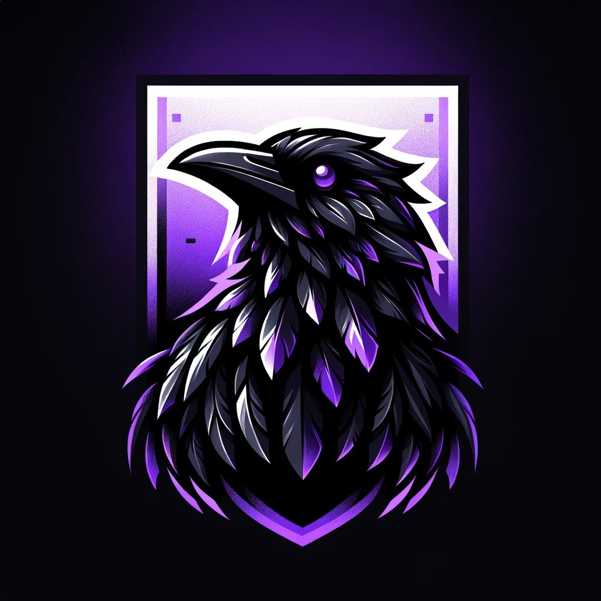

# **Ravenyx Tailwind UI**

  

📖 **Live Documentation:** [View Storybook](https://rnx-ravenyx.github.io/ravenyx-tailwind-ui/)

[License](https://github.com/RNX-Ravenyx/ravenyx-tailwind-ui/blob/main/LICENSE)  
[Contributors](https://github.com/RNX-Ravenyx/ravenyx-tailwind-ui/graphs/contributors)  
  

🚀 **Ravenyx Tailwind UI** is a **modern, scalable UI component library** built with **React, Tailwind CSS, Storybook, and TypeScript**. Designed for rapid development, it provides reusable components optimized for **performance, accessibility, and customization**.

> **🔥 Fully open-source & maintained by Ravenyx.**  
> **🌍 Used for building enterprise-grade Next.js and React apps.**

---

## **✨ Features**

✔️ **Built with Tailwind CSS** for styling consistency  
✔️ **Component-based & customizable** with Tailwind themes  
✔️ **Pre-configured Storybook** for interactive documentation  
✔️ **Supports Dark Mode & Custom Themes**  
✔️ **Strict TypeScript Support**  
✔️ **Unit & E2E Testing (Vitest, Playwright)**  
✔️ **Optimized for Next.js & React Projects**  
✔️ **Lightweight & Scalable UI Components**

---

## **📦 Installation**

Install the package via PNPM:

`pnpm add @ravenyx/tailwind-ui`

---

## **🚀 Usage**

### **1️⃣ Import & Use Components**

`import { Button } from '@ravenyx/tailwind-ui';  export default function App() {   return <Button type="primary">Click Me</Button>; }`

### **2️⃣ Customize via Tailwind Config**

Modify **`tailwind.config.ts`** to override the theme:

`export default {   theme: {     extend: {       colors: {         primary: '#FF5733', // Custom Primary Color       },     },   }, };`

---

## **📖 Documentation**

📌 **Live Storybook Documentation →**  
Interactive documentation is available via **Storybook**.

---

## **🎯 Contributing**

Contribution is currently not accepted.

1️⃣ **Fork & Clone the Repo**

`git clone https://github.com/ravenyx/ravenyx-tailwind-ui.git`

2️⃣ **Install Dependencies**

`pnpm install`

3️⃣ **Start Storybook (for UI Development)**

`pnpm run storybook`

4️⃣ **Submit a Pull Request** 🚀

---

## **📜 License**

This project is licensed under **Custom License**. See the [LICENSE](./LICENSE) file for details.

---

## **👥 Contributors**

<table> <tr> <td align="center"><a href="https://github.com/sudo-ditto"> <b>Loretta Krasteva</b></a></td> </tr> </table>

🚀 Join us in **building the future of UI components!**

---

## **📡 Support & Community**

---

## **🚀 Deployment & Updates**

- **Deploying Storybook:** `pnpm run deploy-storybook`
- **Publishing to NPM:** `pnpm run build && pnpm publish --access public`

🔄 **Auto-updates via GitHub Actions.**

---

## **🏆 Badges & Links**
